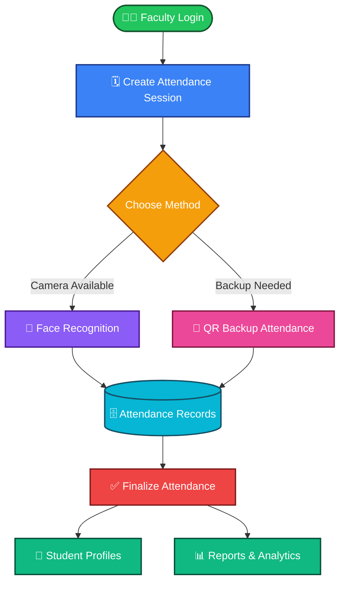
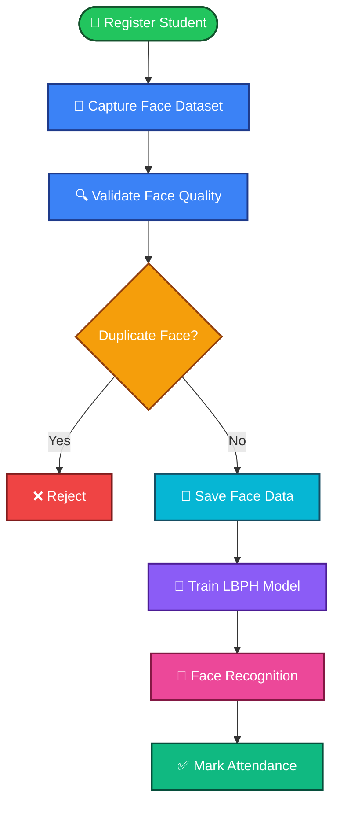
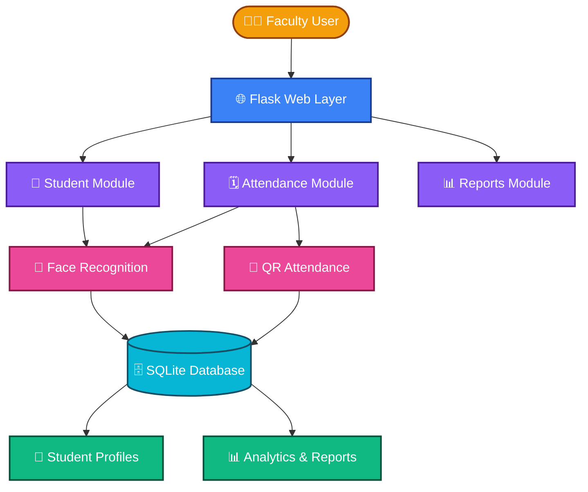
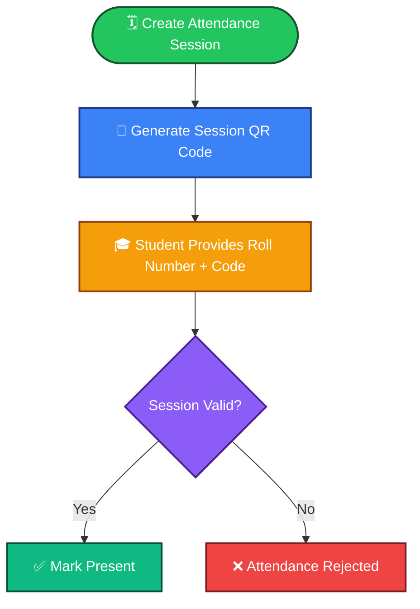
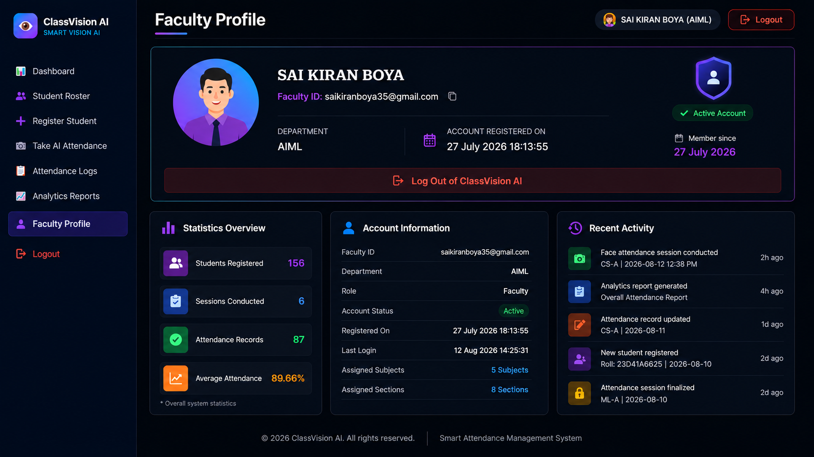

<div align="center">

# 🚀 ClassVision AI

### 🎓 Smart Attendance Management System Using Face Recognition & QR Backup


<br/>


<br/><br/>

**🤖 Smart&nbsp; • &nbsp;🔐 Secure&nbsp; • &nbsp;📊 Automated&nbsp; • &nbsp;⚡ Real-Time**

</div>

---

### 👨‍💻 Developed By

# **SAI KIRAN BOYA**

> Transforming attendance into intelligent automation.

---

## 📖 Overview

**ClassVision AI** is a smart attendance management system designed to automate student attendance using face recognition technology, while providing QR-based backup attendance when face recognition is unavailable.

The system combines:

- Faculty authentication
- Student registration
- Face dataset capture
- Global duplicate-face prevention
- LBPH-based face recognition
- QR backup attendance
- Voice notifications
- Attendance session management
- Attendance editing and audit tracking
- Student profiles
- Subject-wise attendance
- Overall attendance calculation
- Reports and analytics

The project is designed as a practical solution for educational institutions and organizations that need reliable digital attendance management.

---

## ❗ Problem Statement

Traditional attendance systems often depend on manual processes. These methods can consume classroom time, create record-keeping work, allow proxy attendance, and make attendance analysis more difficult.

ClassVision AI addresses these problems by automating the attendance workflow through computer vision and digital record management.

---

## 🎯 Objectives

- Automate student attendance using face recognition
- Reduce manual attendance effort and classroom time
- Reduce the possibility of proxy attendance
- Prevent duplicate face registration
- Provide QR attendance as a backup method
- Maintain structured digital attendance records
- Provide subject-wise and overall attendance information
- Provide useful reports and analytics for faculty members

---

## ✨ Key Features

<table border="1" cellpadding="10" cellspacing="0" style="border-collapse: collapse; width: 100%; border: 1px solid black;">
  <thead>
    <tr style="background-color:#1f2937; color:#ffffff;">
      <th style="border: 1px solid black; padding: 8px;">Feature</th>
      <th style="border: 1px solid black; padding: 8px;">Description</th>
    </tr>
  </thead>
  <tbody>
    <tr>
      <td style="border: 1px solid black; padding: 8px;"><b>🔐 Faculty Authentication</b></td>
      <td style="border: 1px solid black; padding: 8px;">Faculty members can register and securely log in before accessing the attendance management system.</td>
    </tr>
    <tr style="background-color:#f3f4f6;">
      <td style="border: 1px solid black; padding: 8px;"><b>📝 Student Registration</b></td>
      <td style="border: 1px solid black; padding: 8px;">Faculty can register students using academic information such as name, roll number, branch, section, and related details.</td>
    </tr>
    <tr>
      <td style="border: 1px solid black; padding: 8px;"><b>📸 Face Dataset Capture</b></td>
      <td style="border: 1px solid black; padding: 8px;">The system captures multiple facial images for a student and prepares them for LBPH model training.</td>
    </tr>
    <tr style="background-color:#f3f4f6;">
      <td style="border: 1px solid black; padding: 8px;"><b>🚫 Global Duplicate Face Prevention</b></td>
      <td style="border: 1px solid black; padding: 8px;">Checks a new face against existing registered student faces across the system. <b>One face = one student.</b> Duplicate checks are independent of branch and section.</td>
    </tr>
    <tr>
      <td style="border: 1px solid black; padding: 8px;"><b>🤖 Face Recognition Attendance</b></td>
      <td style="border: 1px solid black; padding: 8px;">Registered students are identified through the webcam using OpenCV and the LBPH face recognition algorithm.</td>
    </tr>
    <tr style="background-color:#f3f4f6;">
      <td style="border: 1px solid black; padding: 8px;"><b>🔊 Voice Notification</b></td>
      <td style="border: 1px solid black; padding: 8px;">Provides voice feedback for important attendance and recognition events.</td>
    </tr>
    <tr>
      <td style="border: 1px solid black; padding: 8px;"><b>📱 QR Backup Attendance</b></td>
      <td style="border: 1px solid black; padding: 8px;">When face recognition cannot be used due to camera, lighting, or other limitations, QR attendance can be used as an alternative.</td>
    </tr>
    <tr style="background-color:#f3f4f6;">
      <td style="border: 1px solid black; padding: 8px;"><b>🗓️ Attendance Sessions</b></td>
      <td style="border: 1px solid black; padding: 8px;">Faculty can create attendance sessions for a subject, branch, section, and date, then conduct and finalize attendance.</td>
    </tr>
    <tr>
      <td style="border: 1px solid black; padding: 8px;"><b>✏️ Attendance Editing</b></td>
      <td style="border: 1px solid black; padding: 8px;">Authorized attendance corrections can be made for previously conducted sessions with an audit reason.</td>
    </tr>
    <tr style="background-color:#f3f4f6;">
      <td style="border: 1px solid black; padding: 8px;"><b>👤 Student Profiles</b></td>
      <td style="border: 1px solid black; padding: 8px;">View name, roll number, registered image, branch/section, subject-wise attendance, present/absent sessions, overall attendance, and history.</td>
    </tr>
    <tr>
      <td style="border: 1px solid black; padding: 8px;"><b>📊 Reports & Analytics</b></td>
      <td style="border: 1px solid black; padding: 8px;">Provides attendance summaries and visual reports to help faculty monitor attendance performance.</td>
    </tr>
  </tbody>
</table>

---

## 🔄 System Workflow



---

## 🧠 Face Recognition Workflow



---

## 🛠️ Technologies Used

<table border="1" cellpadding="10" cellspacing="0" style="border-collapse: collapse; width: 100%; border: 1px solid black;">
  <thead>
    <tr style="background-color:#1f2937; color:#ffffff;">
      <th style="border: 1px solid black; padding: 8px;">Category</th>
      <th style="border: 1px solid black; padding: 8px;">Technologies</th>
    </tr>
  </thead>
  <tbody>
    <tr><td style="border: 1px solid black; padding: 8px;">🐍 Backend</td><td style="border: 1px solid black; padding: 8px;">Python, Flask</td></tr>
    <tr style="background-color:#f3f4f6;"><td style="border: 1px solid black; padding: 8px;">🌐 Frontend</td><td style="border: 1px solid black; padding: 8px;">HTML, CSS, JavaScript</td></tr>
    <tr><td style="border: 1px solid black; padding: 8px;">👁️ Computer Vision</td><td style="border: 1px solid black; padding: 8px;">OpenCV</td></tr>
    <tr style="background-color:#f3f4f6;"><td style="border: 1px solid black; padding: 8px;">🧠 Face Recognition</td><td style="border: 1px solid black; padding: 8px;">LBPH</td></tr>
    <tr><td style="border: 1px solid black; padding: 8px;">🗄️ Database</td><td style="border: 1px solid black; padding: 8px;">SQLite</td></tr>
    <tr style="background-color:#f3f4f6;"><td style="border: 1px solid black; padding: 8px;">📊 Data Processing</td><td style="border: 1px solid black; padding: 8px;">Pandas, NumPy</td></tr>
    <tr><td style="border: 1px solid black; padding: 8px;">🔊 Voice Notifications</td><td style="border: 1px solid black; padding: 8px;">pyttsx3</td></tr>
    <tr style="background-color:#f3f4f6;"><td style="border: 1px solid black; padding: 8px;">📈 Charts</td><td style="border: 1px solid black; padding: 8px;">Chart.js</td></tr>
    <tr><td style="border: 1px solid black; padding: 8px;">🚀 Production Server</td><td style="border: 1px solid black; padding: 8px;">Gunicorn</td></tr>
  </tbody>
</table>

---

## 🏗️ Architecture



---

## 📁 Project Structure

```text
CLASSVISION-AI/
│
├── classvision/
│   ├── __init__.py
│   ├── app.py
│   │
│   ├── services/
│   │   ├── __init__.py
│   │   ├── face_service.py
│   │   └── voice_service.py
│   │
│   └── templates/
│       ├── attendance/
│       ├── auth/
│       ├── dashboard/
│       ├── profile/
│       ├── reports/
│       └── students/
│
├── backend/
│   ├── app.py
│   ├── auth/
│   ├── recognition.py
│   ├── student/
│   └── teacher/
│
├── frontend/
│   ├── app/
│   ├── components/
│   ├── public/
│   ├── package.json
│   └── ...
│
├── TrainingImage/
├── TrainingImageLabel/
├── StudentDetails/
├── Attendance/
│
├── requirements.txt
├── backend/requirements.txt
├── Procfile
├── gunicorn.conf.py
├── runtime.txt
├── .env.example
├── .gitignore
├── AMS.ico
└── README.md
```

> Runtime face datasets, trained models, attendance exports, environment files, and generated caches are intentionally excluded from the public repository when appropriate.

---

## 🧩 Main Application Modules

<table border="1" cellpadding="10" cellspacing="0" style="border-collapse: collapse; width: 100%; border: 1px solid black;">
  <thead>
    <tr style="background-color:#1f2937; color:#ffffff;">
      <th style="border: 1px solid black; padding: 8px;">Module</th>
      <th style="border: 1px solid black; padding: 8px;">Responsibilities</th>
    </tr>
  </thead>
  <tbody>
    <tr>
      <td style="border: 1px solid black; padding: 8px;"><code>classvision/app.py</code></td>
      <td style="border: 1px solid black; padding: 8px;">Main Flask application containing routes and core workflows: authentication, dashboard, student registration, attendance sessions, face attendance, QR attendance, reports, student profiles, attendance APIs.</td>
    </tr>
    <tr style="background-color:#f3f4f6;">
      <td style="border: 1px solid black; padding: 8px;"><code>classvision/services/face_service.py</code></td>
      <td style="border: 1px solid black; padding: 8px;">Handles the computer vision pipeline: face detection, image preprocessing, face quality checks, dataset handling, duplicate-face detection, LBPH model training, face recognition.</td>
    </tr>
    <tr>
      <td style="border: 1px solid black; padding: 8px;"><code>classvision/services/voice_service.py</code></td>
      <td style="border: 1px solid black; padding: 8px;">Provides voice notifications for system events such as successful attendance and recognition-related messages.</td>
    </tr>
    <tr style="background-color:#f3f4f6;">
      <td style="border: 1px solid black; padding: 8px;"><code>classvision/templates/</code></td>
      <td style="border: 1px solid black; padding: 8px;">Contains UI pages: login/registration, dashboard, student management, attendance, QR attendance, reports, student profiles, faculty profile.</td>
    </tr>
  </tbody>
</table>

---

## 🗓️ Attendance Management

The system manages attendance through session-based records. A finalized attendance session represents a conducted attendance event for the selected class context.

The system supports:

- Present marking
- Absent marking
- Attendance editing
- Audit reasons for manual corrections
- Attendance history
- Subject-wise attendance
- Overall attendance percentage

---

## 📱 QR Backup Attendance

QR attendance is provided as a backup mechanism when face recognition cannot be used.



---

## 📊 Reports and Analytics

ClassVision AI provides analytics to help faculty understand attendance performance, including:

- Present students
- Absent students
- Subject-wise attendance
- Overall attendance
- Attendance history
- Student-wise performance
- Attendance summaries and charts

---

## 🏢 Applications

<table border="1" cellpadding="10" cellspacing="0" style="border-collapse: collapse; width: 100%; border: 1px solid black;">
  <tr style="background-color:#1f2937; color:#ffffff;">
    <th style="border: 1px solid black; padding: 8px;">🏫 Schools</th>
    <th style="border: 1px solid black; padding: 8px;">🎓 Colleges</th>
    <th style="border: 1px solid black; padding: 8px;">🏛️ Universities</th>
    <th style="border: 1px solid black; padding: 8px;">📚 Coaching Institutes</th>
  </tr>
  <tr>
    <td style="border: 1px solid black; padding: 8px; text-align:center;">Training Centers</td>
    <td style="border: 1px solid black; padding: 8px; text-align:center;">Corporate Offices</td>
    <td style="border: 1px solid black; padding: 8px; text-align:center;">Government Orgs</td>
    <td style="border: 1px solid black; padding: 8px; text-align:center;">Hospitals</td>
  </tr>
</table>

---
## 🌐 Languages Used

<table border="1" cellpadding="10" cellspacing="0" style="border-collapse: collapse; width: 100%; border: 1px solid black;">
<thead>
<tr style="background-color:#1f2937; color:#ffffff;">
<th style="border: 1px solid black; padding: 8px;">Language</th>
<th style="border: 1px solid black; padding: 8px;">Usage</th>
</tr>
</thead>
<tbody>
<tr>
<td style="border: 1px solid black; padding: 8px;">🔷 TypeScript</td>
<td style="border: 1px solid black; padding: 8px;"><b>42.6%</b></td>
</tr>
<tr style="background-color:#f3f4f6;">
<td style="border: 1px solid black; padding: 8px;">🐍 Python</td>
<td style="border: 1px solid black; padding: 8px;"><b>33.0%</b></td>
</tr>
<tr>
<td style="border: 1px solid black; padding: 8px;">🟧 HTML</td>
<td style="border: 1px solid black; padding: 8px;"><b>24.0%</b></td>
</tr>
<tr style="background-color:#f3f4f6;">
<td style="border: 1px solid black; padding: 8px;">⚪ Other</td>
<td style="border: 1px solid black; padding: 8px;"><b>0.4%</b></td>
</tr>
</tbody>
</table>

<div align="center">


</div>


---
## 💡 Advantages

- Reduces manual attendance work
- Saves classroom time
- Reduces proxy attendance
- Maintains digital records
- Provides quick attendance analysis
- Provides a backup QR workflow
- Makes student attendance easier to monitor
- Centralizes attendance management

---

## ⚙️ Installation

### 1. Clone the repository

```bash
git clone https://github.com/saikiranboya955/CLASSVISION-AI.git
cd CLASSVISION-AI
```

### 2. Create a virtual environment

**Windows PowerShell**

```powershell
python -m venv .venv
.\.venv\Scripts\Activate.ps1
```

### 3. Install dependencies

```bash
pip install -r requirements.txt
```

### 4. Configure environment settings

Use `.env.example` as the reference for required environment variables.

### 5. Run the application

```bash
python -m classvision.app
```

The application will start on the local Flask server and the terminal will display the address to open in a browser.

---

## 📋 Requirements

- Python
- Webcam for face registration and face recognition
- OpenCV-compatible environment
- Modern web browser
- Required Python dependencies from `requirements.txt`

---

## 🖥️ Application Screenshots

### 🔐 Login

<p align="center">
  
</p>
---

### 📊 Dashboard

<p align="center">
  
</p>
---

### 📸 Student Registration & Face Dataset Capture

<p align="center">
  
</p>
---

### 🤖 Face Recognition Attendance

<p align="center">
  
</p>
---

### 📱 QR Backup Attendance

<p align="center">
  
</p>
---
### 👤 Student Profile

<p align="center">
  
</p>
---

### 📈 Reports & Analytics

<p align="center">
  
</p>

---

### 👨‍🏫 Faculty Profile

<p align="center">
  
</p>
---

## 🚀 Future Scope

<table border="1" cellpadding="10" cellspacing="0" style="border-collapse: collapse; width: 100%; border: 1px solid black;">
  <tr style="background-color:#1f2937; color:#ffffff;">
    <th style="border: 1px solid black; padding: 8px;">☁️ Cloud Deployment</th>
    <th style="border: 1px solid black; padding: 8px;">📱 Mobile App</th>
    <th style="border: 1px solid black; padding: 8px;">🧠 Deep Learning Recognition</th>
  </tr>
  <tr>
    <td style="border: 1px solid black; padding: 8px; text-align:center;">🎥 Multi-Camera Attendance</td>
    <td style="border: 1px solid black; padding: 8px; text-align:center;">📩 Automated Notifications</td>
    <td style="border: 1px solid black; padding: 8px; text-align:center;">📊 Advanced Analytics</td>
  </tr>
  <tr>
    <td colspan="3" style="border: 1px solid black; padding: 8px; text-align:center;">🏫 Multi-Campus Deployment</td>
  </tr>
</table>

---

## 👨‍💻 Developer

### **SAI KIRAN BOYA**

Developed as an academic project focused on applying Artificial Intelligence, Computer Vision, Web Development, and Database Management to real-world attendance automation.

---

## 🎓 Academic Project

ClassVision AI demonstrates the practical application of:

- 🤖 Artificial Intelligence
- 👁️ Computer Vision
- 🌐 Web Development
- 🗄️ Database Management
- 📊 Data Analytics
- 🔐 Secure Attendance Management

---

## 🔗 Repository

<div align="center">


[](https://github.com/saikiranboya955/CLASSVISION-AI)
</div>

---

<div align="center">

### ⭐ ClassVision AI

**Smart • Secure • Automated Attendance**

</div>
