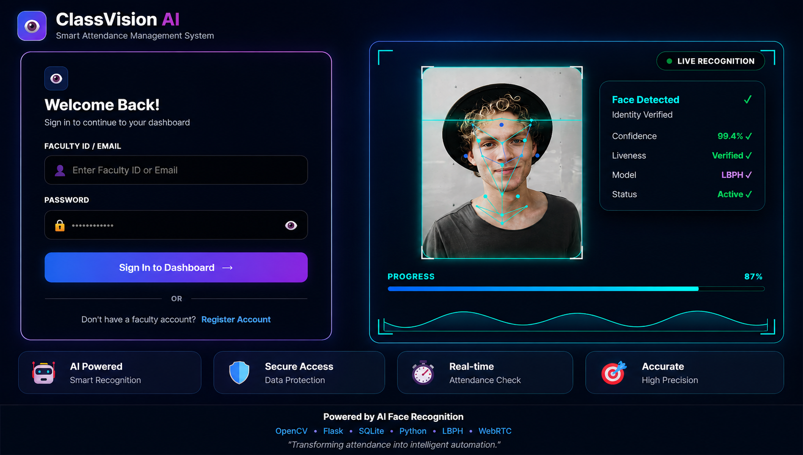
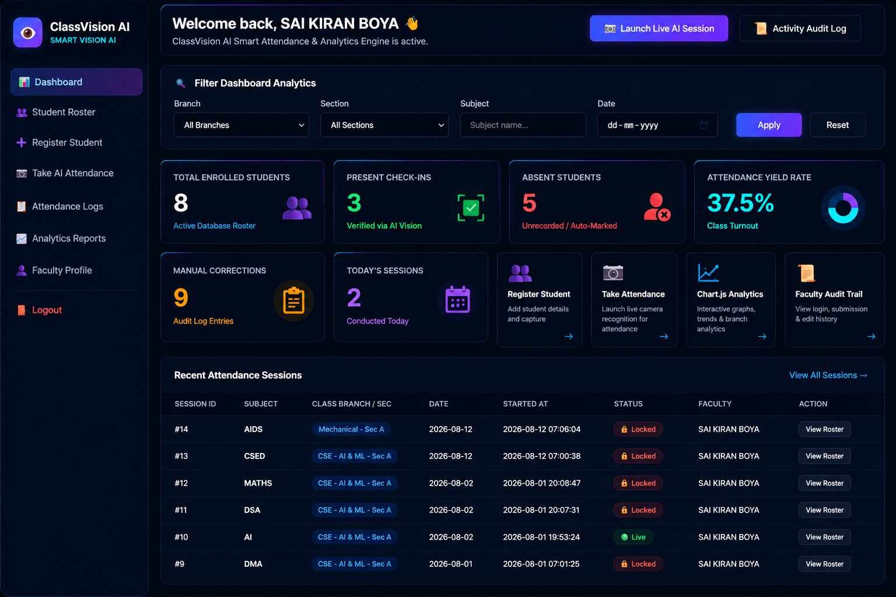
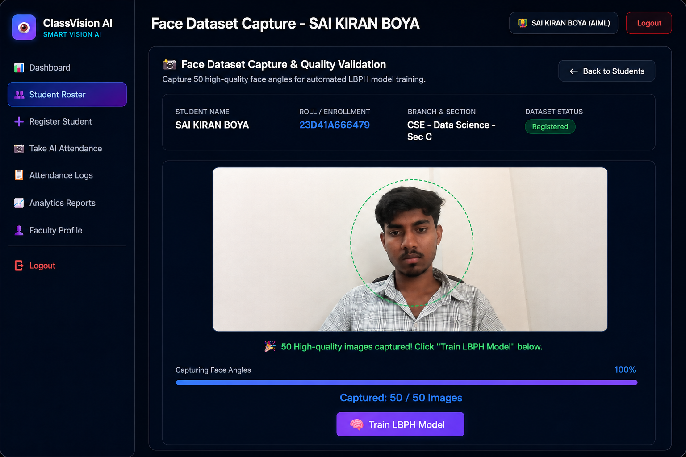
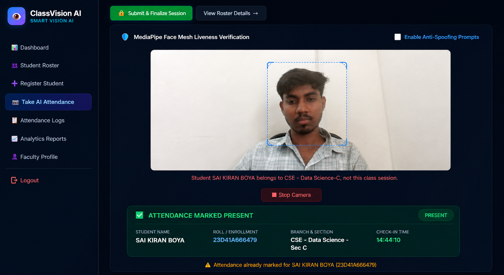
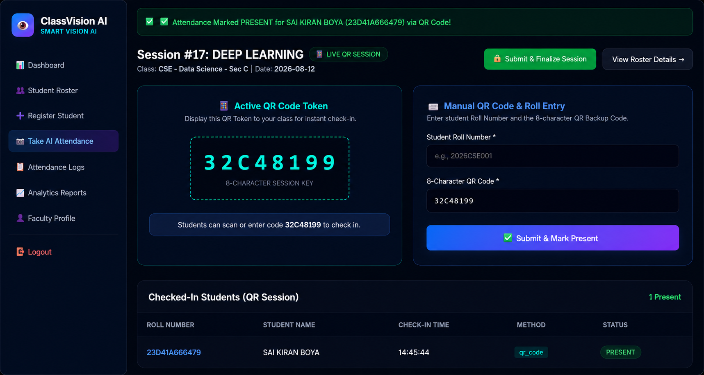
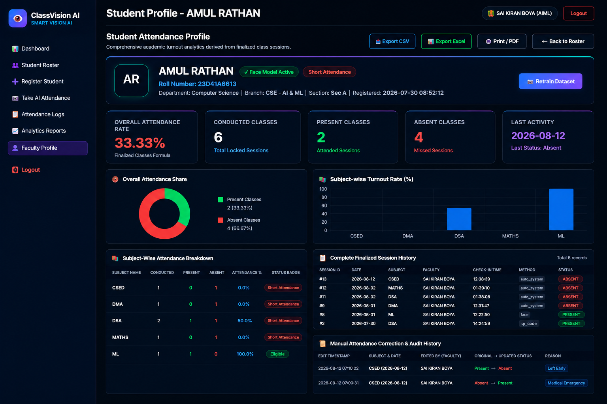
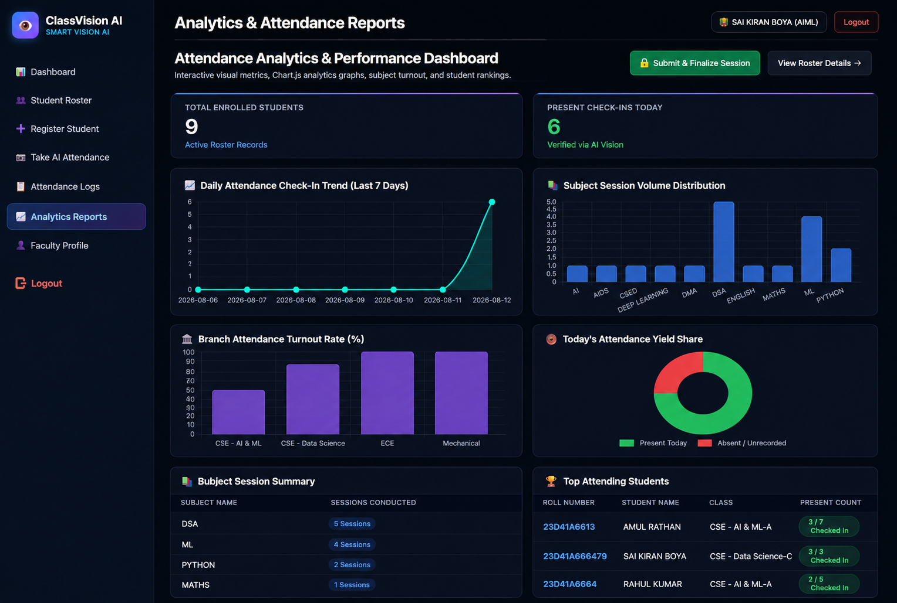

# ClassVision AI

## Smart Attendance Management System Using Face Recognition and QR Backup

<p align="center">
  <strong>ClassVision AI</strong><br>
  Smart, Secure, and Automated Attendance Management
</p>

<p align="center">
  Python • Flask • OpenCV • LBPH • SQLite • JavaScript
</p>

---

## Overview

**ClassVision AI** is a smart attendance management system designed to automate student attendance using face recognition technology, while providing QR-based backup attendance when face recognition is unavailable.

The system combines:

* Faculty authentication
* Student registration
* Face dataset capture
* Global duplicate-face prevention
* LBPH-based face recognition
* QR backup attendance
* Voice notifications
* Attendance session management
* Attendance editing and audit tracking
* Student profiles
* Subject-wise attendance
* Overall attendance calculation
* Reports and analytics

The project is designed as a practical solution for educational institutions and organizations that need reliable digital attendance management.

---

## Problem Statement

Traditional attendance systems often depend on manual processes. These methods can consume classroom time, create record-keeping work, allow proxy attendance, and make attendance analysis more difficult.

ClassVision AI addresses these problems by automating the attendance workflow through computer vision and digital record management.

---

## Objectives

* Automate student attendance using face recognition.
* Reduce manual attendance effort and classroom time.
* Reduce the possibility of proxy attendance.
* Prevent duplicate face registration.
* Provide QR attendance as a backup method.
* Maintain structured digital attendance records.
* Provide subject-wise and overall attendance information.
* Provide useful reports and analytics for faculty members.

---

## Key Features

### Faculty Authentication

Faculty members can register and securely log in before accessing the attendance management system.

### Student Registration

Faculty can register students using academic information such as name, roll number, branch, section, and related details.

### Face Dataset Capture

The system captures multiple facial images for a student and prepares them for LBPH model training.

### Global Duplicate Face Prevention

The system checks a new face against existing registered student faces across the system.

**One face = one student.**

The duplicate check is independent of branch and section, preventing the same person from being registered again using different student details.

### Face Recognition Attendance

Registered students can be identified through the webcam using OpenCV and the LBPH face recognition algorithm.

### Voice Notification

The system provides voice feedback for important attendance and recognition events.

### QR Backup Attendance

When face recognition cannot be used because of camera, lighting, or other practical limitations, QR attendance can be used as an alternative.

### Attendance Sessions

Faculty can create attendance sessions for a subject, branch, section, and date, then conduct and finalize attendance.

### Attendance Editing

Authorized attendance corrections can be made for previously conducted sessions with an audit reason.

### Student Profiles

Faculty can open an individual student profile to view:

* Student name
* Roll number
* Registered image
* Branch and section
* Subject-wise attendance
* Present sessions
* Absent sessions
* Overall attendance
* Attendance history

### Reports and Analytics

The system provides attendance summaries and visual reports to help faculty monitor attendance performance.

---

## System Workflow

```text
Faculty Login
      |
      v
Create Attendance Session
      |
      +---------------------------+
      |                           |
      v                           v
Face Recognition            QR Backup Attendance
      |                           |
      +-------------+-------------+
                    |
                    v
             Attendance Records
                    |
                    v
            Finalize Attendance
                    |
          +---------+---------+
          |                   |
          v                   v
   Student Profiles      Reports & Analytics
```

---

## Face Recognition Workflow

```text
Register Student
      |
      v
Capture Face Dataset
      |
      v
Validate Face Quality
      |
      v
Check Duplicate Face
      |
      +----------+
      |          |
   Duplicate   New Face
      |          |
   Reject       Save
                 |
                 v
          Train LBPH Model
                 |
                 v
          Face Recognition
                 |
                 v
        Mark Attendance
```

---

## Technologies Used

| Category            | Technologies          |
| ------------------- | --------------------- |
| Backend             | Python, Flask         |
| Frontend            | HTML, CSS, JavaScript |
| Computer Vision     | OpenCV                |
| Face Recognition    | LBPH                  |
| Database            | SQLite                |
| Data Processing     | Pandas, NumPy         |
| Voice Notifications | pyttsx3               |
| Charts              | Chart.js              |
| Production Server   | Gunicorn              |

---

## Architecture

```text
                    +----------------------+
                    |      Faculty User    |
                    +----------+-----------+
                               |
                               v
                    +----------------------+
                    |   Flask Web Layer    |
                    +----------+-----------+
                               |
             +-----------------+-----------------+
             |                 |                 |
             v                 v                 v
      Student Module   Attendance Module   Reports Module
             |                 |
             v                 v
      Face Recognition     QR Attendance
             |                 |
             +--------+--------+
                      |
                      v
               SQLite Database
                      |
          +-----------+-----------+
          |                       |
          v                       v
   Student Profiles        Analytics & Reports
```

---

## Project Structure

```text
CLASSVISION-AI/
│
├── classvision/
│   ├── __init__.py
│   ├── app.py
│   │
│   ├── services/
│   │   ├── __init__.py
│   │   ├── face_service.py
│   │   └── voice_service.py
│   │
│   └── templates/
│       ├── attendance/
│       ├── auth/
│       ├── dashboard/
│       ├── profile/
│       ├── reports/
│       └── students/
│
├── backend/
│   ├── app.py
│   ├── auth/
│   ├── recognition.py
│   ├── student/
│   └── teacher/
│
├── frontend/
│   ├── app/
│   ├── components/
│   ├── public/
│   ├── package.json
│   └── ...
│
├── TrainingImage/
├── TrainingImageLabel/
├── StudentDetails/
├── Attendance/
│
├── requirements.txt
├── backend/requirements.txt
├── Procfile
├── gunicorn.conf.py
├── runtime.txt
├── .env.example
├── .gitignore
├── AMS.ico
└── README.md
```

> Runtime face datasets, trained models, attendance exports, environment files, and generated caches are intentionally excluded from the public repository when appropriate.

---

## Main Application Modules

### `classvision/app.py`

Main Flask application containing routes and core application workflows including:

* Authentication
* Dashboard
* Student registration
* Attendance sessions
* Face attendance
* QR attendance
* Reports
* Student profiles
* Attendance APIs

### `classvision/services/face_service.py`

Handles the computer vision pipeline, including:

* Face detection
* Image preprocessing
* Face quality checks
* Dataset handling
* Duplicate-face detection
* LBPH model training
* Face recognition

### `classvision/services/voice_service.py`

Provides voice notifications for system events such as successful attendance and recognition-related messages.

### `classvision/templates/`

Contains the user interface pages for:

* Login and registration
* Dashboard
* Student management
* Attendance
* QR attendance
* Reports
* Student profiles
* Faculty profile

---

## Attendance Management

The system manages attendance through session-based records.

A finalized attendance session represents a conducted attendance event for the selected class context.

The system supports:

* Present marking
* Absent marking
* Attendance editing
* Audit reasons for manual corrections
* Attendance history
* Subject-wise attendance
* Overall attendance percentage

---

## QR Backup Attendance

QR attendance is provided as a backup mechanism when face recognition cannot be used.

The workflow is:

```text
Create Attendance Session
          |
          v
Generate Session QR Code
          |
          v
Student Provides Roll Number + Code
          |
          v
Validate Session
          |
          v
Mark Present
```

---

## Reports and Analytics

ClassVision AI provides analytics to help faculty understand attendance performance.

The system can present information such as:

* Present students
* Absent students
* Subject-wise attendance
* Overall attendance
* Attendance history
* Student-wise performance
* Attendance summaries and charts

---

## Applications

ClassVision AI can be adapted for:

* Schools
* Colleges
* Universities
* Coaching institutes
* Training centers
* Corporate offices
* Government organizations
* Hospitals
* Other organizations requiring structured attendance management

---

## Advantages

* Reduces manual attendance work
* Saves classroom time
* Reduces proxy attendance
* Maintains digital records
* Provides quick attendance analysis
* Provides a backup QR workflow
* Makes student attendance easier to monitor
* Centralizes attendance management

---

## Installation

### 1. Clone the repository

```bash
git clone https://github.com/saikiranboya955/CLASSVISION-AI.git
cd CLASSVISION-AI
```

### 2. Create a virtual environment

#### Windows PowerShell

```powershell
python -m venv .venv
.\.venv\Scripts\Activate.ps1
```

### 3. Install dependencies

```bash
pip install -r requirements.txt
```

### 4. Configure environment settings

Use `.env.example` as the reference for required environment variables.

### 5. Run the application

```bash
python -m classvision.app
```

The application will start on the local Flask server and the terminal will display the address to open in a browser.

---

## Requirements

* Python
* Webcam for face registration and face recognition
* OpenCV-compatible environment
* Modern web browser
* Required Python dependencies from `requirements.txt`

---

## Screenshots

Actual ClassVision AI interface screenshots can be added here:

### Login



### Dashboard



### Student Registration



### Face Recognition Attendance



### QR Attendance



### Student Profile



### Reports and Analytics



---

## Future Scope

Potential future improvements include:

* Cloud-hosted deployment
* Mobile application
* Deep learning-based face recognition
* Multi-camera attendance
* Notification integration
* Advanced institutional analytics
* Large-scale deployment for multiple campuses

---


## Academic Project

ClassVision AI was developed as an academic project to demonstrate the practical application of:

* Artificial Intelligence
* Computer Vision
* Web Development
* Database Management
* Automated Attendance Systems

The project focuses on solving a real-world attendance management problem using a combination of software and AI technologies.

---

## Repository

**GitHub:**
https://github.com/saikiranboya955/CLASSVISION-AI

---

## License

This project is developed for academic and educational purposes.
